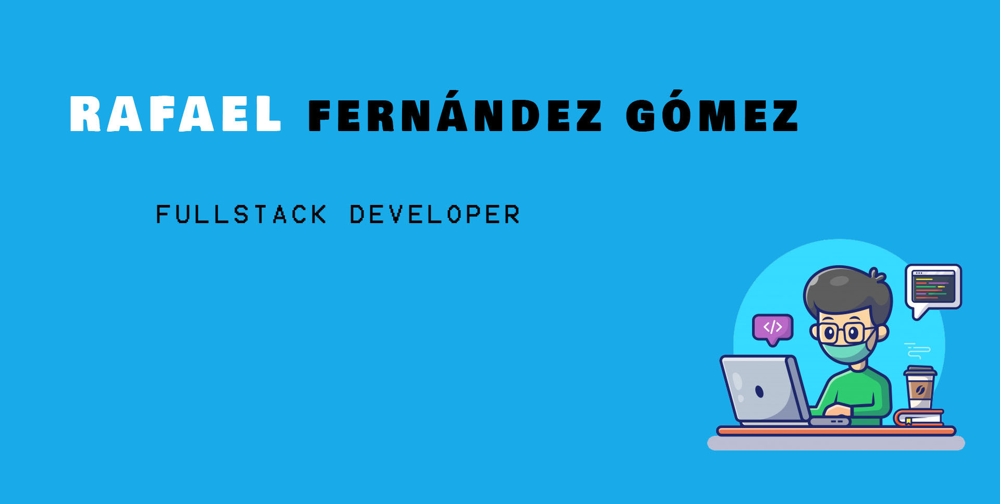

  

- 🔭 I’m currently working on my project DietME2 
- 🌱 I’m currently learning **Python**
- Ask me about React, MongoDB
- 🌍 I'm from Valencia, Spain

## Find Me
- Sharing updates on <a href="https://www.linkedin.com/in/rafael-fernandez-gomez-/">Linkedin</a> 
- My <a href="https://twitter.com/ferrowrafael">Twitter</a>  account 
-  Contact me **ferrowrafael@gmail.com** ✉️

## My Projects 👨‍🔬
<!--   - <a href="https://github.com/FerrowRafael/GH-Proyecto3-RedSocial-Frontend">Social Network (React/Redux/Laravel)</a> 
  - <a href="https://github.com/FerrowRafael/GH-Proyecto2-Ecommerce-Frontend">Ecommerce (React/Redux/Express/MongoDB)</a> 
  - <a href="https://github.com/danielvazquezguerra/geekshubs-frontend-p6/tree/dev">Movies Netflix (Angular/Express/Sequelize)</a>  -->

### Now
  - <a href="https://github.com/FerrowRafael/DietMe_2_Laravel">DietMe2 Backend (Laravel)</a> 
  - <a href="https://github.com/FerrowRafael/Diet_ME_2_FrontEnd">DietMe2 FrontEnd (Angular)</a> 
  - <a href="https://github.com/FerrowRafael/prueba-tecnica-punkapi">Prueba Técnica PunkApi (Angular)</a> 
  - <a href="https://github.com/FerrowRafael/Movies_VUE">Movies Netflix (VueJS/TMDB API)</a> 
  
  
## Technologies & Tools 🔧
### Languages
<ul>
  <li>Javascript</li>
  <li>Typescript</li>
  <li>PHP</li>
  <li>SQL</li>
</ul>

### FRONTEND
<ul>
  <li>HTML5 & CSS3</li>
  <li>Angular</li>
  <li>React</li>
  <li>Ionic</li>
  <li>Wordpress</li>
</ul>

<ul>
  <li>SASS</li>
  <li>Bootstrap</li>
  <li>Tailwind</li>
</ul>

### BACKEND
<ul>
  <li>NodeJS</li>
  <li>ExpressJS</li>
  <li>Laravel</li>
</ul>

<ul>
  <li>MySQL</li>
  <li>MongoDB</li>
</ul>

### HERRAMIENTAS
<ul>
  <li>Visual Studio Code</li>
  <li>Slack</li>
  <li>Github / Gitlab</li>
  <li>Asana</li>
  <li>Jira</li>
</ul>

<!-- 

  
  
  
  
  

  
 
  
 
  

  
  
  
 

 -->
  
  

